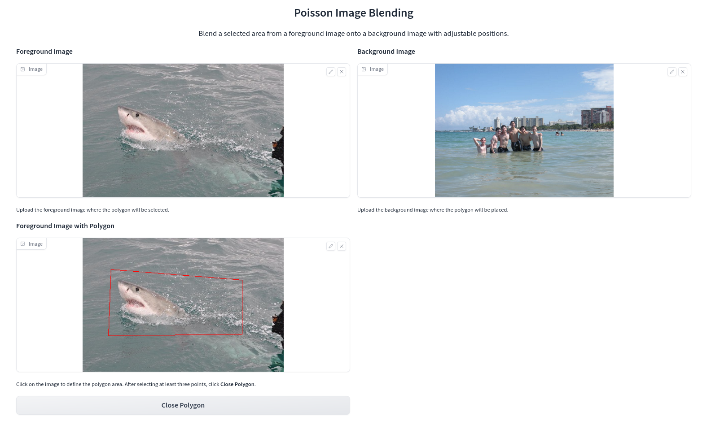
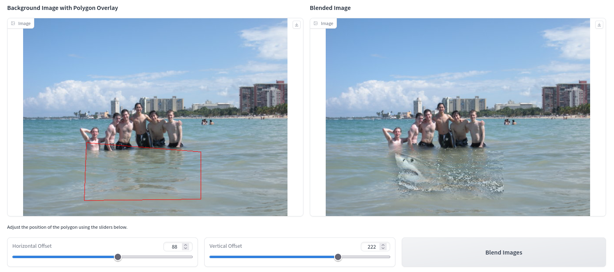
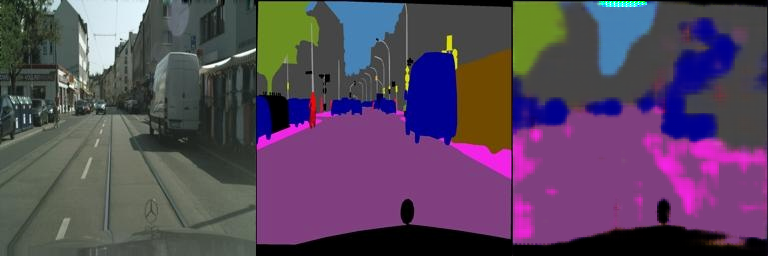

# 02_DIPwithPyTorch

This is an implementation of traditional DIP (Possion Image Editing) and deep learning-based DIP (Pix2Pix) with PyTorch.

## Requirements

To install requirements:

```bash
pip install -r requirements.txt
```

## Poisson Image Editing

### Results





## Deep Learning-Based Pix2Pix

### Datasets

To download `facades` dataset, run this command on Linux:

```bash
bash ./download_facades_dataset.sh
```

To download `cityscapes` dataset, run this command on Linux:

```bash
sed -e 's/facades/cityscapes/g' ./download_facades_dataset.sh | bash
```

### Training

To train the model(s) in the paper, run this command:

```bash
python -u train.py > train.log
```

### Pre-Trained Model

A pre-trained model can be downloaded [here](https://github.com/iw16/DIP-Teaching/releases/pix2pix_model_epoch_800.pth). Dataset `cityscapes` is used. 

### Results

Validation after 400 epochs:



Validation after 800 epochs:


### Contributing

>📋 This repository is under [CC BY-NC 4.0](https://creativecommons.org/licenses/by-nc/4.0/) license. Welcome to create [issues](https://github.com/iw16/DIP-Teaching/issues) and/or [PRs](https://github.com/iw16/DIP-Teaching/pulls). 