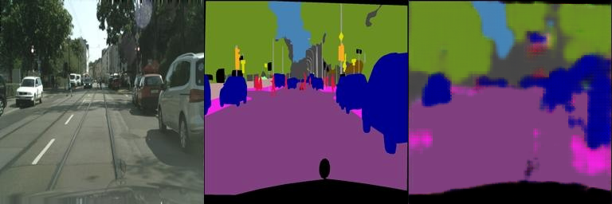
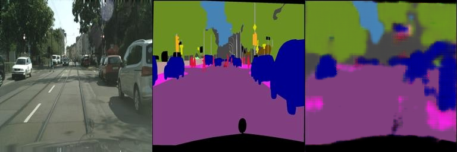
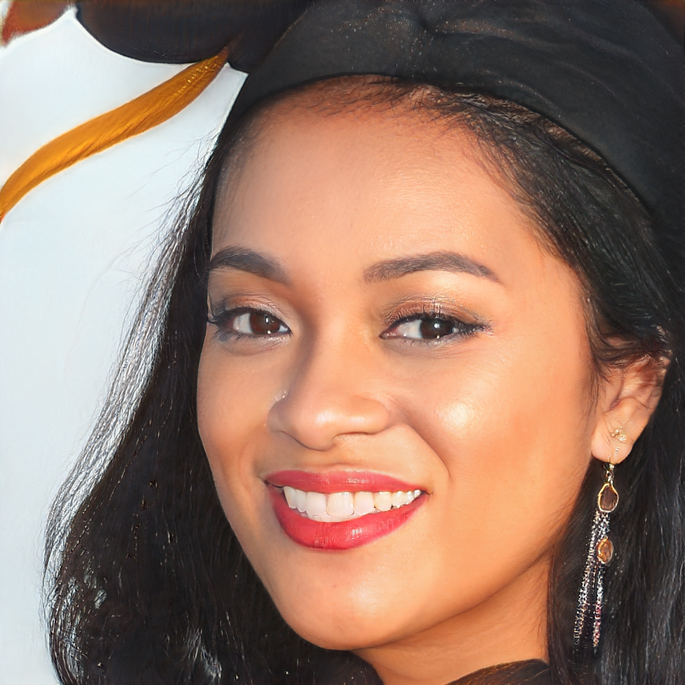
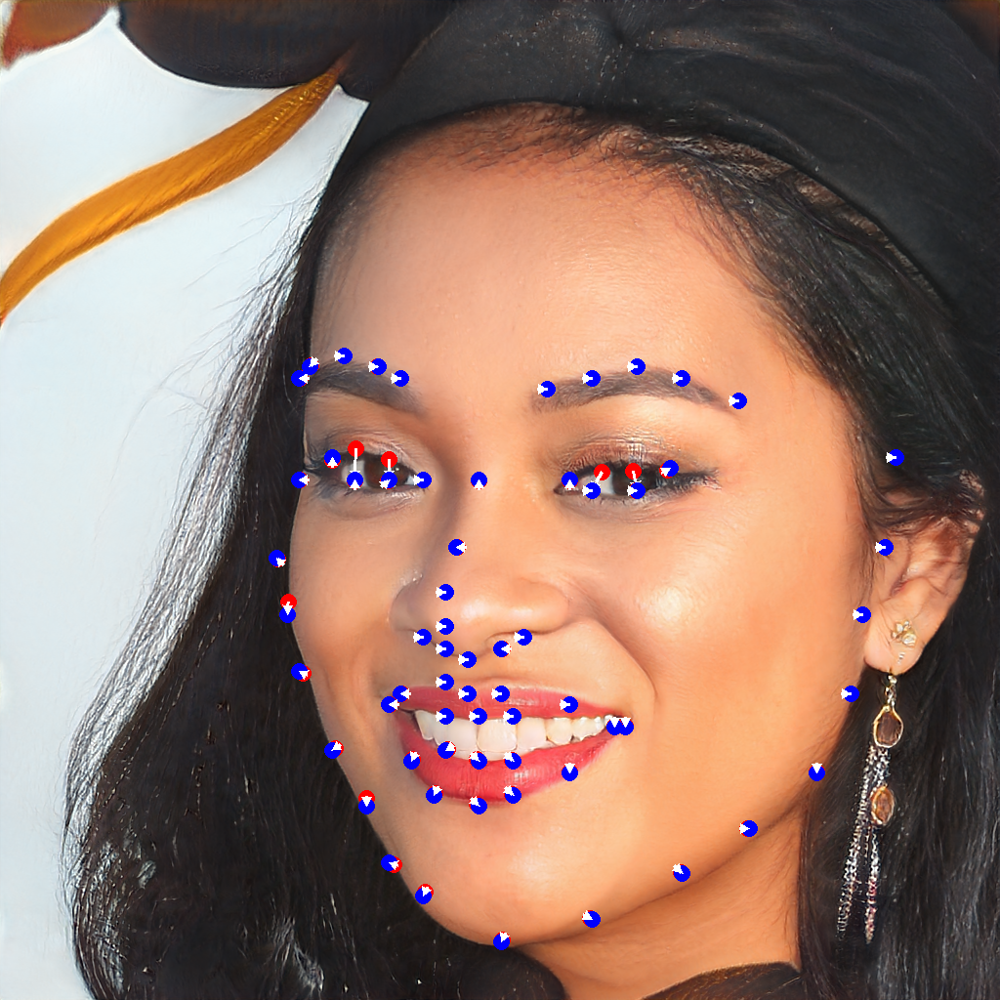
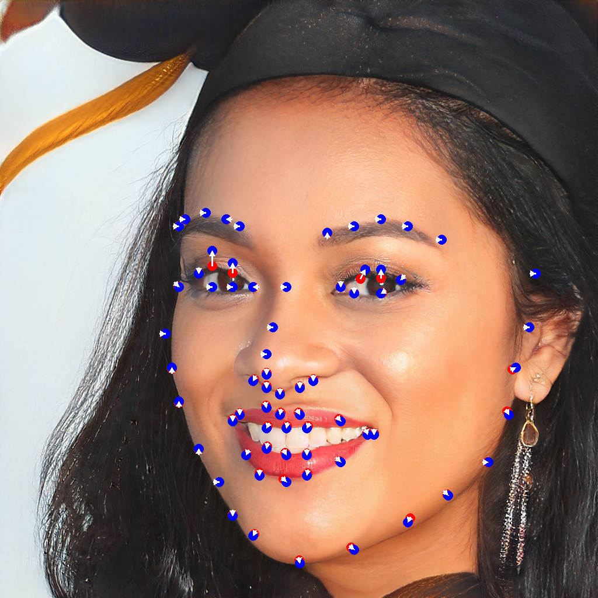
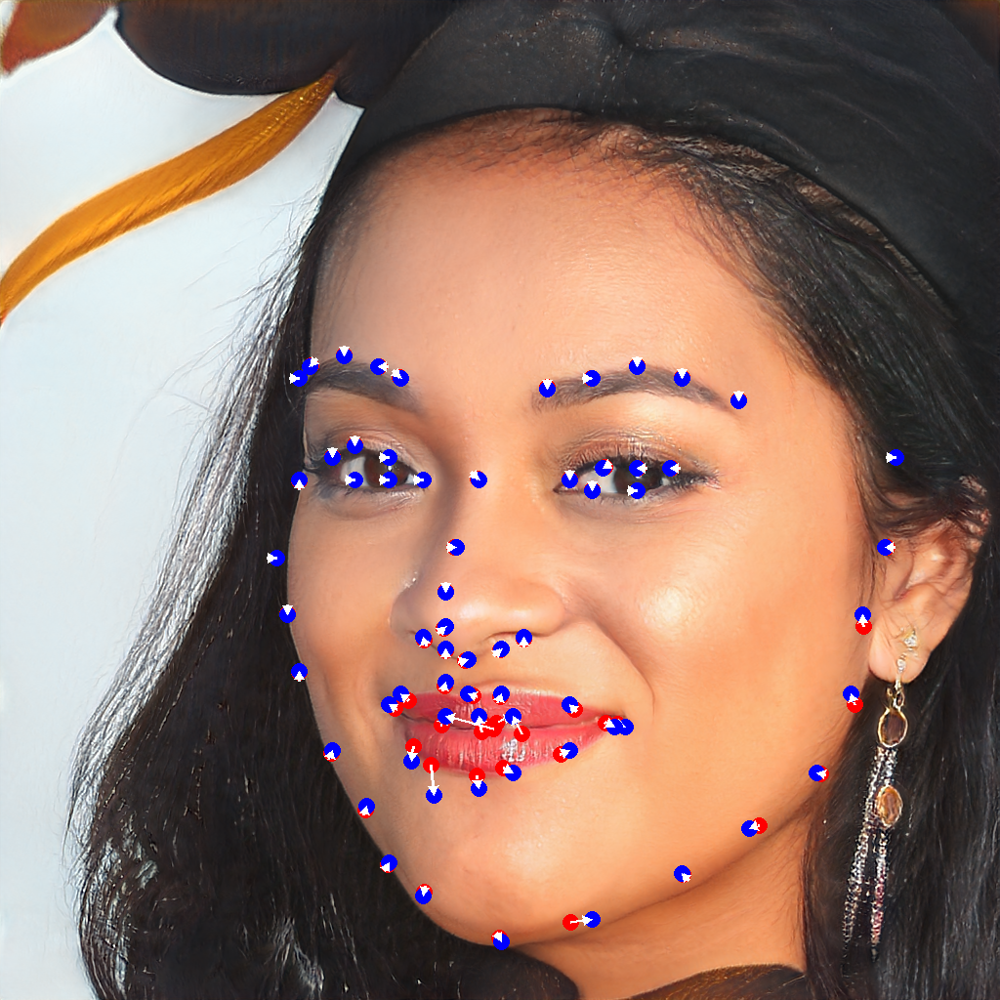
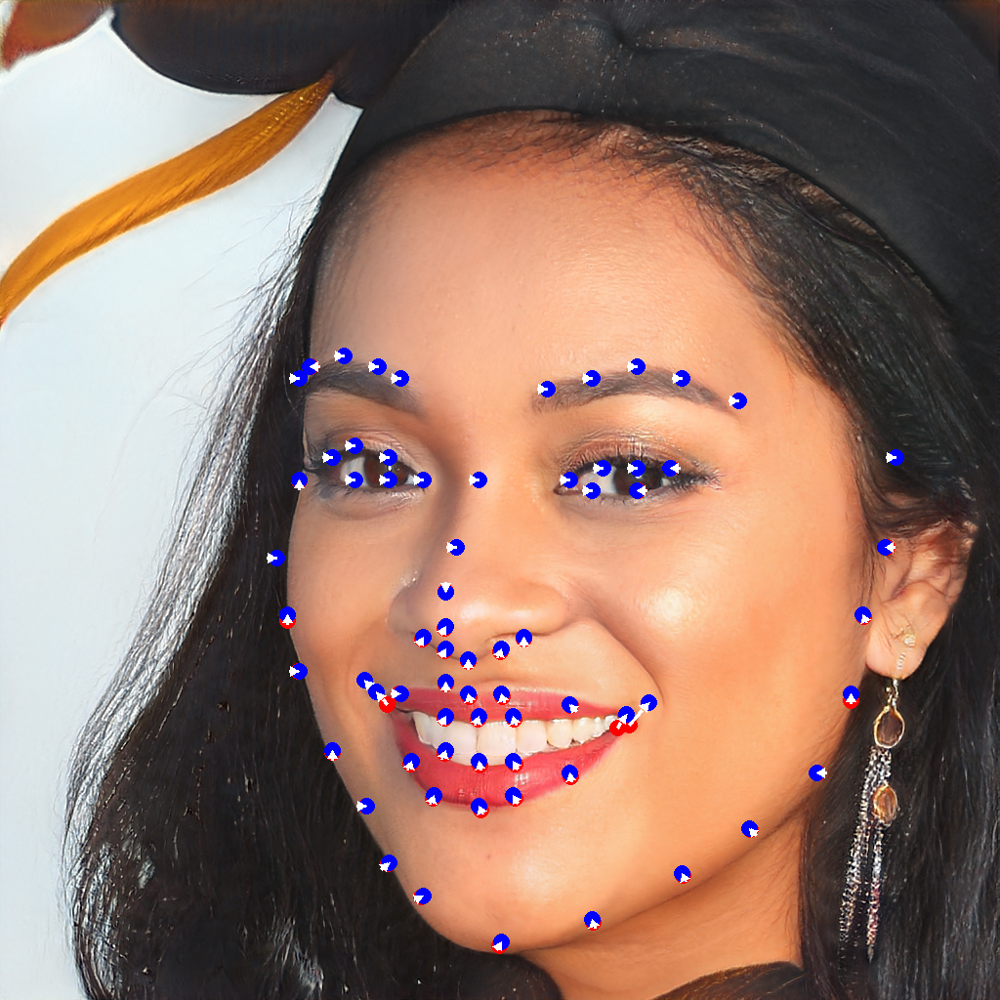
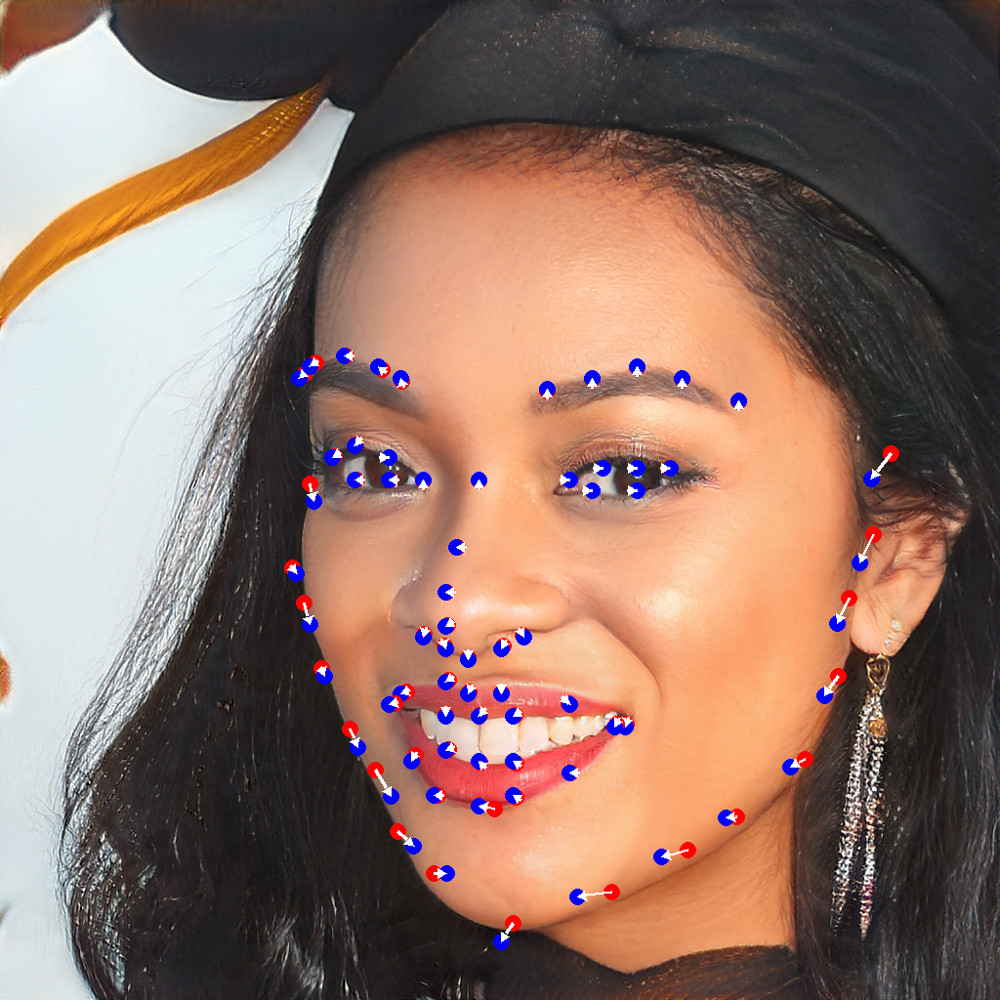

# 03_PlayWithGANs

This is an increment of Pix2Pix with cGAN and a combination of DragGAN and face-alignment.

## Requirements

To install requirements on Linux:

```bash
cd path/to/03_PlayWithGANs
python3 -m venv .venv
source .venv/bin/activate
pip install -r requirements.txt
```

## Deep Learning-Based Pix2Pix with cGAN

### Datasets

To download `facades` dataset, run this command on Linux:

```bash
bash cgan/download_facades_dataset.sh
```

To download `cityscapes` dataset, run this command on Linux:

```bash
sed -e 's/facades/cityscapes/g' cgan/download_facades_dataset.sh | bash
```

### Training

To train the model(s) in the paper, run this command:

```bash
python -u train.py > train.log
```

### Results

Validation after 400 epochs:



Validation after 800 epochs:



## DragGAN & Face-Alignment

### Run

```bash
python -u facegan/combination.py
```

### Results

Original image:



Close eyes:



Expand eyes:



Close lips:



Smile mouth:



Slim face:



Dynamically changing videos are [here](results/). 

## Contributing

>📋 This repository is under [CC BY-NC 4.0](https://creativecommons.org/licenses/by-nc/4.0/) license. Welcome to create [issues](https://github.com/iw16/DIP-Teaching/issues) and/or [PRs](https://github.com/iw16/DIP-Teaching/pulls). 

## Acknowledgements

- Thanks to the [bugs](https://github.com/opengvlab/draggan) by [OpenGVLab](https://github.com/opengvlab) where an implementation of DragGAN is hidden inside. 
- Thanks to [face-alignment](https://github.com/1adrianb/face-alignment) by [Adrian Bulat](https://github.com/1adrianb). 